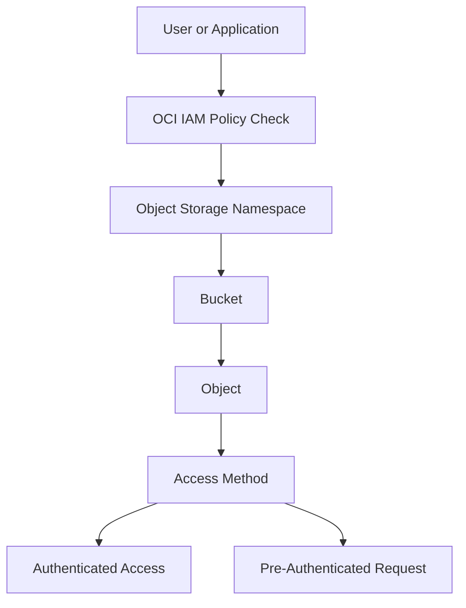
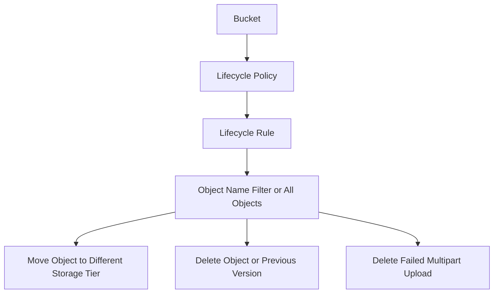

# OCI Object Storage Access Control and Lifecycle Management

## Overview

The repository explains how buckets store objects, how access is controlled through IAM policies, how pre-authenticated requests provide time-bound access, and how lifecycle rules help manage object movement and deletion.
My focus was to explain the product flow in simple terms: bucket and object structure, access control, temporary access through pre-authenticated requests, lifecycle rule behavior, and related storage management options.
This contribution is based on my own OCI product usage and documentation. No confidential, proprietary, or project-specific information is included.

---

## Why I Created This

Object Storage is used in many cloud solutions to store files, backups, reports, logs, extracts, and other unstructured data.
While creating a bucket is simple, the important part is understanding how access and lifecycle controls work together.
I created this repository to explain that flow clearly.

---

## Product Used

Oracle Cloud Infrastructure Object Storage

---

## Object Storage Access Flow

---

## Lifecycle Management Flow

---

## Components Covered

This repository covers the following OCI Object Storage areas:

- Buckets
- Objects
- Object prefixes
- IAM access control
- Pre-authenticated requests
- Lifecycle rules
- Object versioning
- Retention rules
- Replication policy
- Basic security considerations

---

## What I Understood

My main understanding is that Object Storage should not be viewed only as a place to upload files.
A proper Object Storage setup needs clear control around where objects are stored, who can access them, how temporary access is provided, and how objects are managed over time.
Buckets provide the storage boundary. IAM policies control access. Pre-authenticated requests provide temporary access when needed. Lifecycle rules help manage object movement and deletion.
This helped me understand Object Storage from an access control and lifecycle management perspective.
