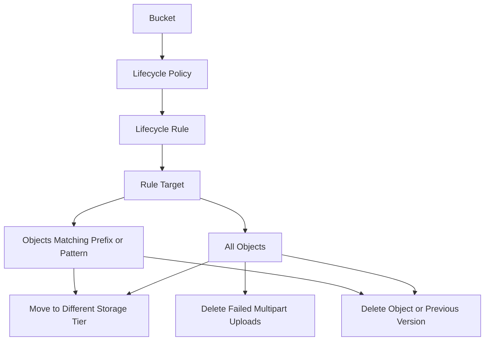

# Lifecycle Management Flow

This diagram shows a simple lifecycle management flow for OCI Object Storage.

Lifecycle management helps automate object movement or deletion based on rules.

The rule can apply to all objects or to selected objects using filters. This is useful when objects need to move to a different storage tier or be removed after a defined period.

---

## What I Understood

My main understanding is that lifecycle rules should be created carefully.
A lifecycle rule can reduce manual work, but it can also delete objects if configured incorrectly. The rule should be tested and reviewed before applying it to important data.
