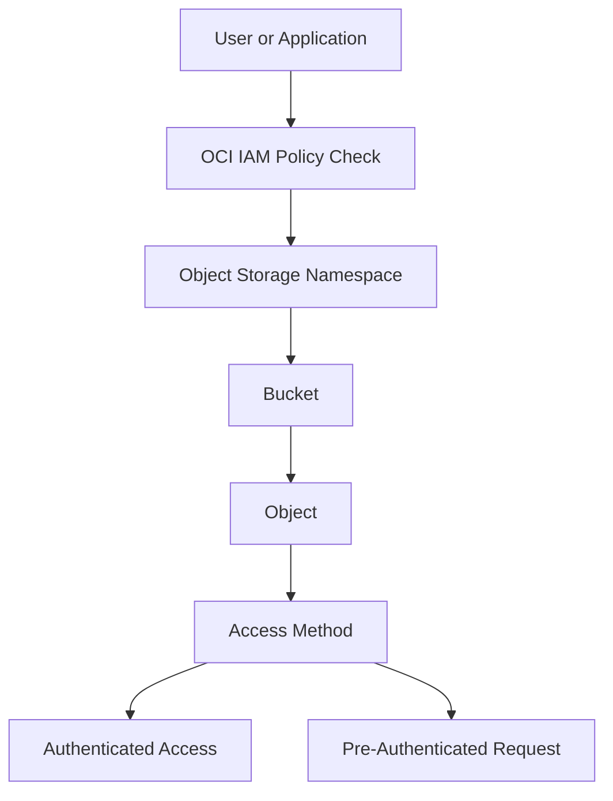

# Object Storage Access Flow

This diagram shows a simple access flow for OCI Object Storage.

The main point is that access to objects should be controlled.
A bucket stores objects, but access is not only about the bucket itself. IAM policies decide who can work with the bucket and objects. Pre-authenticated requests can be used when temporary access is needed without giving the user direct OCI credentials.

---

## What I Understood

My main understanding is that Object Storage access should be intentional.
Users and applications should get only the access they need. If temporary access is required, a pre-authenticated request can be used, but the URL must be handled carefully.
