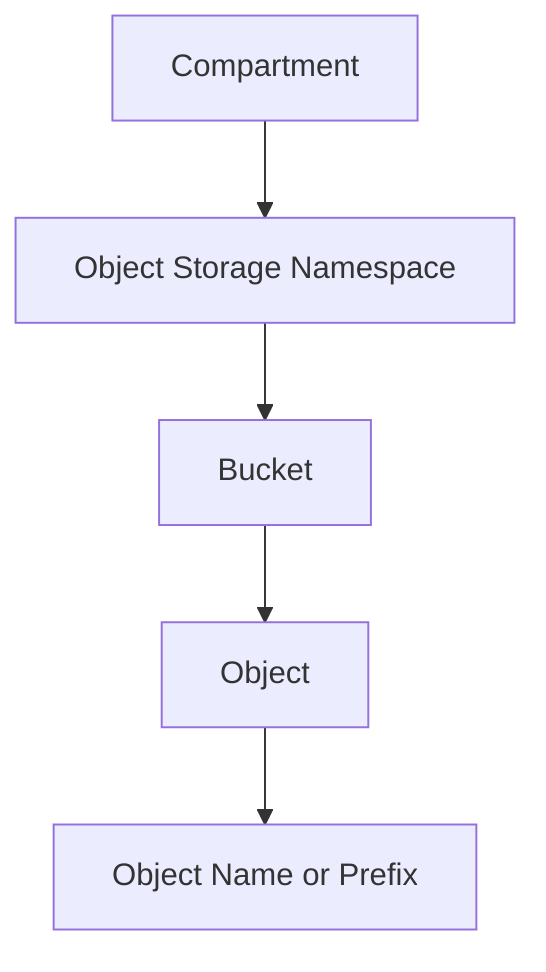

# Bucket and Object Overview

## Overview

OCI Object Storage uses buckets to store objects.
A bucket is created inside a compartment and belongs to an Object Storage namespace. Objects are uploaded into buckets.
Objects can be files, backups, reports, logs, extracts, images, or other unstructured data.

---

## Bucket

A bucket is the main container used to store objects.
A bucket is associated with one compartment. The compartment policies help control what actions users can perform on the bucket and the objects inside it.
Buckets cannot be nested inside other buckets.

---

## Object

An object is the actual file or data uploaded into a bucket.
An object has a name, and the object name is important because it can be used for organization and access control.
Object names can include prefixes such as:

```text
reports/monthly/file1.csv
reports/yearly/file2.csv
logs/application/log1.txt
```

These prefixes can make objects look like folders, but the objects are still stored in a flat structure.

---

## Basic Flow



---

## What I Reviewed

I reviewed the bucket and object relationship from a product usage perspective:

- How buckets are created or reviewed
- How objects are uploaded into a bucket
- How object names and prefixes help organize files
- How bucket access should be controlled through IAM policies
- Why confidential information should not be used in bucket or object names

---

## What I Understood

My main understanding is that a bucket is not just a storage folder.
It is part of the OCI access model because the bucket belongs to a compartment and access is controlled through IAM policies.
Object names also matter because prefixes can support organization, filtering, and more specific access patterns.
