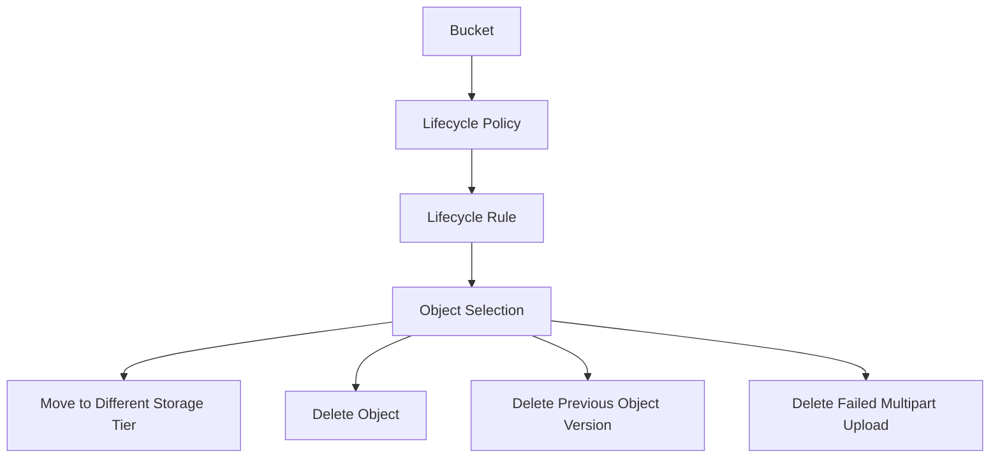

# Lifecycle Management

## Overview

Object lifecycle management is used to automate how objects are moved or deleted over time.
Lifecycle rules are created at the bucket level.
These rules can help reduce manual work when objects need to move to another storage tier or be deleted after a defined period.

---

## Simple Flow

---

## Lifecycle Rule Targets

A lifecycle rule can apply to:

- All objects in a bucket
- Objects matching a prefix
- Objects matching a pattern
- Previous object versions
- Failed or uncommitted multipart uploads

---

## Example Rule Scenarios

| Scenario | Example Use |
|---|---|
| Move older files | Move older objects to a lower-cost storage tier |
| Delete temporary files | Delete temporary files after a defined period |
| Clean failed uploads | Remove failed multipart uploads |
| Manage old versions | Delete previous object versions after review |

---

## Permission Review

Lifecycle policies need proper permissions.

The user or administrator creating the policy must have the right Object Storage access.

The Object Storage service also needs permission to perform lifecycle actions on behalf of the bucket.

---

## Important Point

Lifecycle rules should be reviewed carefully before they are enabled.
A delete rule can remove objects or object versions if the rule is configured incorrectly.
For important data, lifecycle rules should be tested first using non-production or sample data.

---

## What I Reviewed

I reviewed lifecycle management from a product usage perspective:

- Lifecycle policy location in the bucket
- Lifecycle rule creation flow
- Rule target options
- Move and delete action options
- Permission requirement
- Why delete rules should be handled carefully

---

## What I Understood

My main understanding is that lifecycle management is not only a cost feature.
It is also a control feature. It helps manage what happens to objects after upload, but it must be configured carefully because the actions can change storage tier or delete data.
