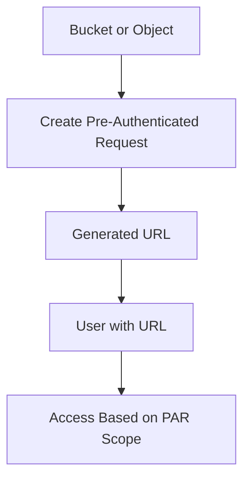

# Pre-Authenticated Requests

## Overview

A pre-authenticated request provides temporary access to a bucket or object without giving the user direct OCI credentials.
This is useful when someone needs access to upload or download an object, but should not be given full OCI account access.

---

## Simple Flow

---

## Access Scope

A pre-authenticated request can be created for different access needs.

Examples:

- Access to one object
- Access to all objects in a bucket
- Access to objects with a specific prefix
- Read access
- Write access
- Read and write access

The scope should be kept as limited as possible.

---

## Important Security Point

The generated URL must be protected.
Anyone who has the URL can access the bucket or object based on the permissions granted in the pre-authenticated request.
For that reason, the URL should not be stored in a public GitHub repository, shared in screenshots, or sent broadly.

---

## Revoking Access

A pre-authenticated request can be deleted when access is no longer needed.
Deleting the pre-authenticated request removes the access provided through that URL.

---

## What I Reviewed

I reviewed pre-authenticated requests from a product usage perspective:

- Where PAR is available in Object Storage
- How PAR is connected to a bucket or object
- How access type affects what the URL can do
- Why expiry and scope are important
- Why the generated URL should not be exposed

---

## What I Understood

My main understanding is that a pre-authenticated request is powerful but sensitive.
It is useful for temporary access, but it must be controlled carefully because access is tied to the URL.
A safer approach is to keep the scope limited, use expiry, and delete the request when it is no longer needed.
