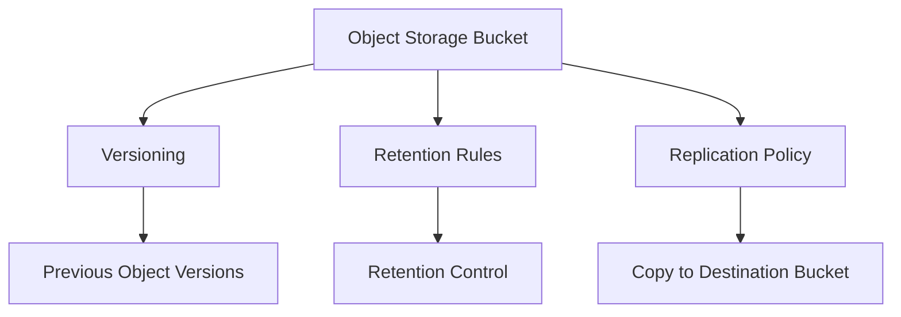

# Versioning, Retention, and Replication

## Overview

OCI Object Storage includes additional controls that help manage object protection and movement.
This document summarizes three related areas:

- Object versioning
- Retention rules
- Replication policy

---

## Object Versioning

Object versioning helps keep previous versions of objects.
This is useful when protection is needed against accidental overwrite or deletion.
When versioning is enabled, a new version can be created when an object is updated.

---

## Retention Rules

Retention rules are used when objects need to be retained for a defined requirement.
Retention should be reviewed carefully because it can affect whether objects can be deleted or changed during the retention period.
Retention is different from lifecycle deletion.
Lifecycle rules can delete or move objects based on rule conditions. Retention rules are used to keep objects protected for retention needs.

---

## Replication Policy

Replication policy can be used to replicate objects from one bucket to another bucket.
This can be in the same region or a different region, depending on the design.
Replication should be planned carefully because it involves source bucket, destination bucket, permissions, and data movement.

---

## Simple Relationship

---

## What I Reviewed

I reviewed these features from a product usage perspective:

- Where versioning is enabled or reviewed
- How previous versions can support recovery
- Why retention rules should be handled carefully
- How replication policy supports object copy to another bucket
- Why permissions and destination setup matter for replication

---

## What I Understood

My main understanding is that Object Storage has more controls than simple upload and download.
Versioning helps with protection from overwrite or deletion. Retention helps protect data for required retention needs. Replication helps copy data to another bucket.
These options should be reviewed based on the storage requirement instead of enabling everything by default.
